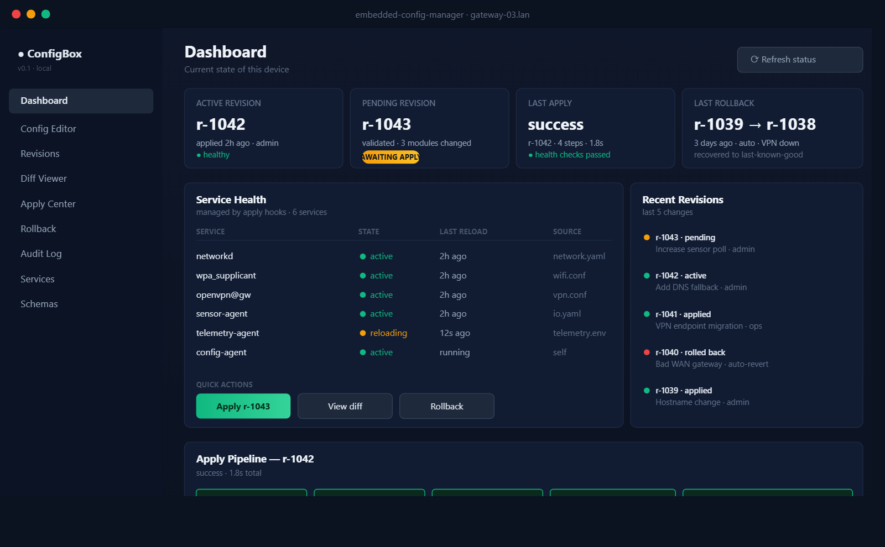

# Embedded Config Manager

Versioned configuration management for Linux-based embedded devices.



This is a local-first config control plane for edge gateways, industrial
controllers and similar appliance-style Linux boxes. The goal is simple: stop
editing JSON files and service configs by hand over SSH, and replace that with
a proper lifecycle - validate, version, apply, roll back.

## Why

A broken config on a remote device isn't a cute bug. It's usually lost
connectivity, a field visit, and a few hours trying to figure out what
actually changed. I kept running into this on gateway deployments, so I
wrote this.

## What it does

- JSON Schema validation per config module, with extra semantic checks
  (IP validity, hostname format, DHCP vs static cross-field rules, range
  checks).
- Every change becomes an immutable revision in SQLite - author, note,
  SHA-256 checksum, validation status, apply status.
- Structured diff between any two revisions (added / removed / modified
  paths).
- Apply pipeline: validate, backup, render via Jinja2, atomic write,
  run reload hooks, run health checks, commit. Every step timed and
  logged as an apply run.
- Automatic rollback if any step fails - previous rendered files are
  restored from backup and the prior active revision is reinstated.
- Dry-run mode on by default (`ECM_DRY_RUN=1`) so filesystem writes go to
  a sandbox dir. Safe to run on any dev machine.
- FastAPI REST endpoints for the full lifecycle.
- Audit log for every mutation.

## Architecture

```text
User / API Request
      │
      ▼
Validation Engine  ──► Revision Store (SQLite)
      │
      ▼
Pending Revision
      │
      ▼
Apply Engine ──► Exporters (Jinja2) ──► Atomic Write ──► Service Hooks ──► Health Checks
      │
      ├── success → Active Revision
      └── failure → Rollback to Last-Known-Good
```

## Layout

```text
embedded-config-manager/
├── agent/            # python package
│   ├── api/          # FastAPI routes
│   ├── apply/        # apply pipeline + rollback
│   ├── core/         # models, settings, errors
│   ├── diff/         # diff engine
│   ├── exporters/    # jinja2 renderer + target registry
│   ├── storage/      # sqlite revision / audit / apply-run store
│   ├── validation/   # schema + semantic validators
│   ├── main.py
│   └── service.py
├── schemas/          # json schemas per module
├── templates/        # jinja2 exporter templates
├── examples/         # example config + target registry
├── tests/            # pytest suite
├── scripts/          # dev helpers
└── systemd/          # unit file for device deployment
```

## Quick start

```bash
python -m venv .venv
source .venv/bin/activate       # windows: .venv\Scripts\activate
pip install -e ".[dev]"

pytest                          # runs in dry-run, doesn't touch system files
./scripts/run-dev.sh            # or: make run
```

API on `http://127.0.0.1:8080`, interactive docs at `/docs`.

To seed an example revision and apply it:

```bash
./scripts/seed-example.sh
```

## Using the API

```bash
BASE=http://127.0.0.1:8080/api/v1

# create a revision
curl -sX POST $BASE/revisions \
  -H "content-type: application/json" \
  -d '{"author":"me","note":"initial","config":'"$(cat examples/config.example.json)"'}'

# diff against the active revision
curl -s "$BASE/revisions/1/diff?against=active" | jq

# apply it
curl -sX POST $BASE/revisions/1/apply | jq

# roll back if something looks wrong
curl -sX POST $BASE/revisions/1/rollback | jq
```

### Endpoints

All under `/api/v1`:

| Method | Path | Purpose |
|---|---|---|
| GET | `/health` | liveness probe |
| GET | `/config/current` | currently active revision |
| GET | `/config/schema?module=...` | merged or per-module schema |
| GET | `/revisions` | list recent revisions |
| POST | `/revisions` | create (and validate) a revision |
| GET | `/revisions/{id}` | full revision payload |
| POST | `/revisions/{id}/validate` | re-run validation |
| GET | `/revisions/{id}/diff?against=...` | structured diff |
| POST | `/revisions/{id}/apply` | run the apply pipeline |
| POST | `/revisions/{id}/rollback` | re-apply a prior revision |
| GET | `/apply-runs/{id}` | apply-run status + steps |
| GET | `/audit` | audit events |

## Schemas

Schemas live under `schemas/`. Drop a `<module>.schema.json` file in there
and it's picked up on startup. The defaults cover:

- `system` - hostname, timezone, ntp
- `network` - interface, dhcp/static, gateway, dns, mtu
- `telemetry` - endpoint, interval, batch size, enabled

## Targets

Render targets are in `examples/targets.json`. Each entry is a jinja2
template, an output path, and optional reload/health shell commands:

```json
{
  "name": "telemetry",
  "template": "env/telemetry.env.j2",
  "output": "/etc/telemetry/config.env",
  "reload": "systemctl reload telemetry-agent",
  "health": "test -f /etc/telemetry/config.env"
}
```

In dry-run mode the output is redirected under `var/sandbox/...` and reload
commands are skipped.

## Environment

| Variable | Default | Purpose |
|---|---|---|
| `ECM_ROOT` | cwd | resolves other defaults |
| `ECM_DATA_DIR` | `$ECM_ROOT/var` | sqlite + backups |
| `ECM_SCHEMAS_DIR` | `$ECM_ROOT/schemas` | schema discovery |
| `ECM_TEMPLATES_DIR` | `$ECM_ROOT/templates` | jinja2 loader root |
| `ECM_TARGETS_FILE` | `$ECM_ROOT/examples/targets.json` | target registry |
| `ECM_DRY_RUN` | `1` | set `0` to write real paths / run hooks |

## Tests

```bash
pytest
```

28 tests covering validation, diff, revision store, apply pipeline, rollback,
and the HTTP layer. They all run in dry-run against a temp dir, so nothing on
your machine gets touched.

## Deployment

There's a reference systemd unit in `systemd/`. Install the package under
`/opt/embedded-config-manager`, copy the unit, enable it:

```bash
sudo cp systemd/embedded-config-manager.service /etc/systemd/system/
sudo systemctl enable --now embedded-config-manager
```

On real devices, set `ECM_DRY_RUN=0` and tighten `ReadWritePaths` in the
unit file to the minimum your targets need.

Tested on Debian 12, Ubuntu 22.04, and a couple of Buildroot-based ARM
gateways. Python 3.11+.

## Roadmap

- core engine - revision store, validation, diff (done)
- apply + rollback - exporters, atomic write, hooks, health checks (done)
- small web panel for editing and history
- auth, tightened audit UI, backup retention policy
- signed revisions, profile templates, import/export bundles

## License

MIT. See [LICENSE](LICENSE).

Feel free to use this project however you like - fork it, ship it, tear it
apart, build something bigger on top of it. If you end up using it in
something public, a small credit or a link back would make my day, but
it's not a requirement. Thanks for taking a look.
